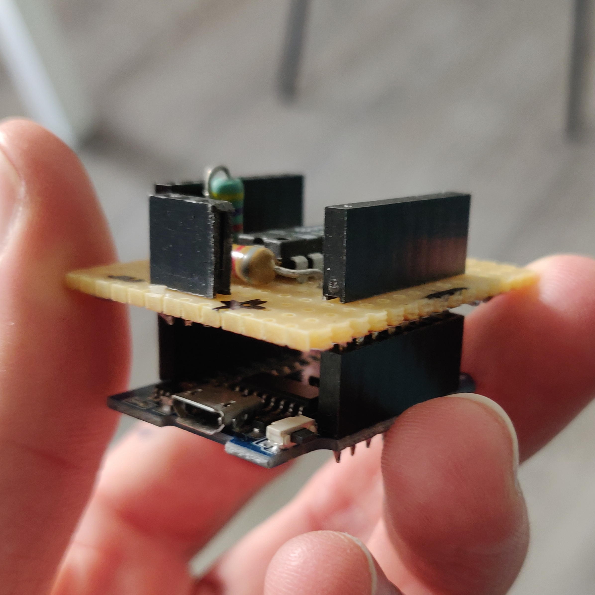
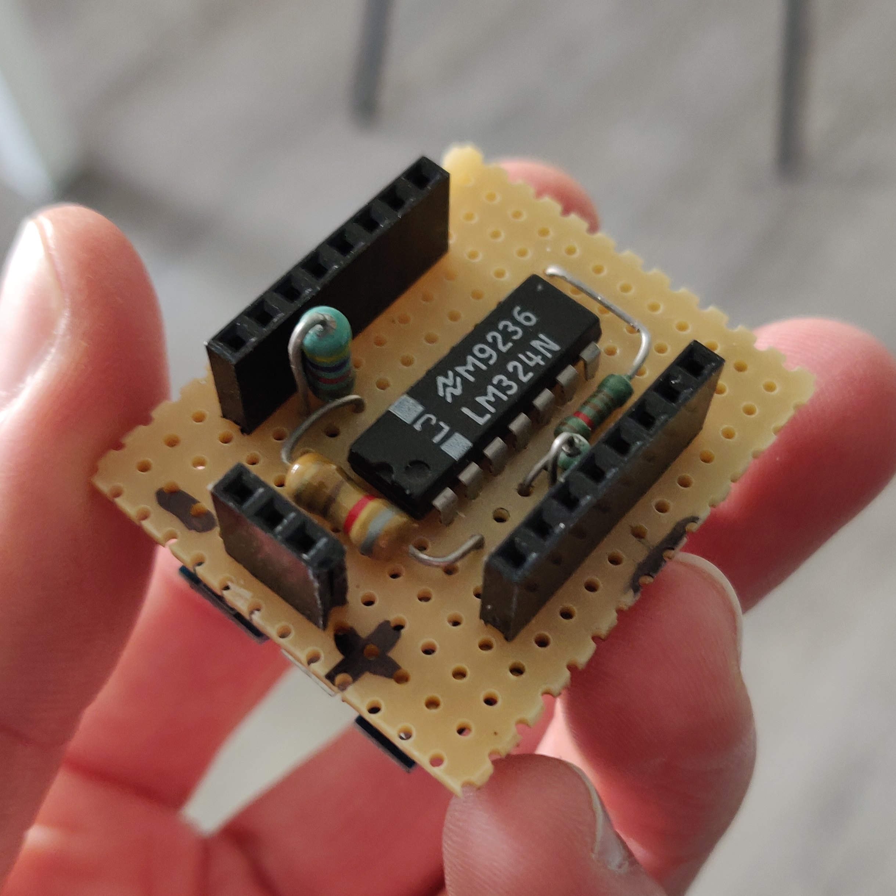
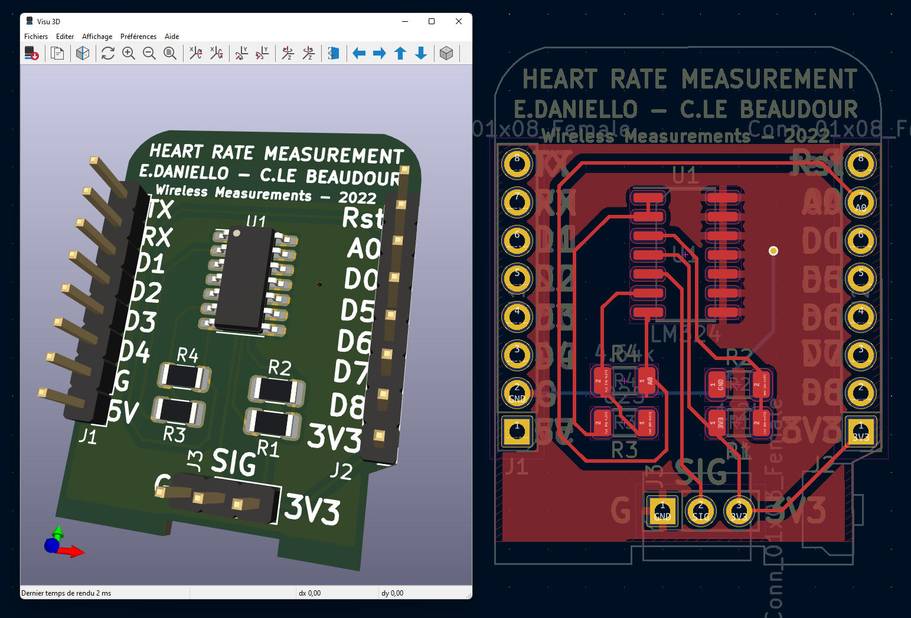

# Heart rate measurement project 
  
## Description of the project

This project consists of a bracelet connected to a wifi network, with the ability to read the heartbeat of the person wearing it. The data from each bracelet is sent in real-time to a central server and allows remote monitoring of all the heart data of each patient.

This project was done as part of the Wireless Measurements course at the University of Oulu in 2022.

## Material required

  * 2x WeMos D1 mini (or other ESP8266 development board)

  * 1x [Pulse Sensor](https://pulsesensor.com/products/pulse-sensor-amped)
  
  * 1x [Custom WeMos D1 mini shield](#arduino-shield)

This hardware is for a single smart bracelet and monitoring interface. For each new bracelet you need to add a WeMos D1 mini and a pulse sensor.

## Arduino libraries required

  * ESP8266 NodeMCU LittleFS Filesystem Uploader - [installation tutorial](https://randomnerdtutorials.com/install-esp8266-nodemcu-littlefs-arduino/)

  * Arduino_JSON - via Arduino library Manager

  * ESPAsyncWebServer - .zip in [ArduinoCode/lib](./ArduinoCode/lib) folder

  * ESPAsyncTCP - .zip in [ArduinoCode/lib](./ArduinoCode/lib) folder

## Arduino Programs

### ESP of the hospital

All files are in the [ArduinoCode/ESP_hospital](./ArduinoCode/ESP_hospital) folder
  
  1. Upload the Arduino code to the WeMos

  2. Upload the [server files](./ArduinoCode/ESP_hospital/data) via LittleFS Filesystem Uploader

### ESP of the sensor

All files are in the [ArduinoCode/ESP_sensor](./ArduinoCode/ESP_sensor) folder

  1. Set the IP address of the hospital's ESP in the sensor code

  2. Upload the Arduino code to the WeMos
  
  3. Connect the shield and the sensor to the Wemos 

## Arduino Shield

### Shield on a prototyping PCB
  
The custom shield can be made on a prototyping pcb. A schematic for the simulation is available in an [OrCAD project](./OpampPulseSensorSimulation).

  
  

### Shield PCB

The shield has also been developed for a real pcb, in a [KiCad project](./ArduinoShield).

 

## Developers

  * Eliott Daniello - [GitHub](https://github.com/EliottDaniello)

  * Cédric Le Beaudour - [GitHub](https://github.com/Cedricleb)
